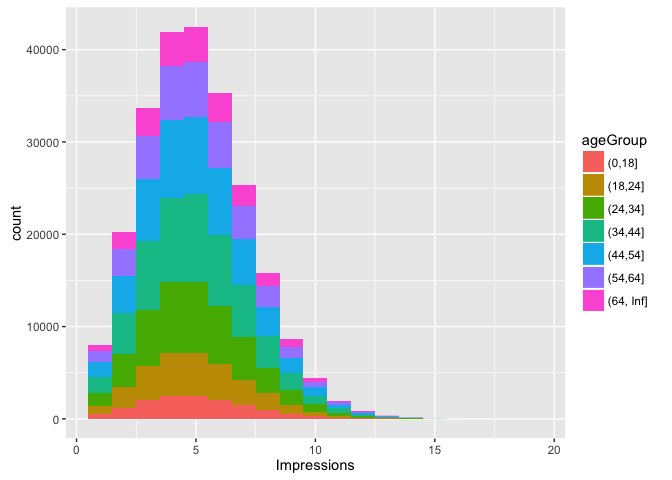
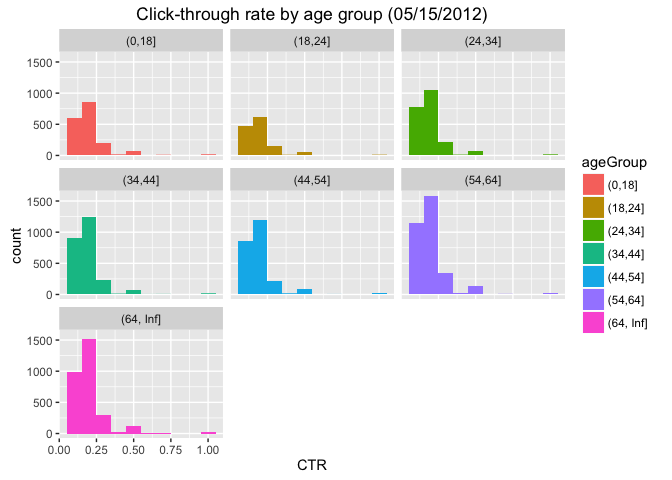
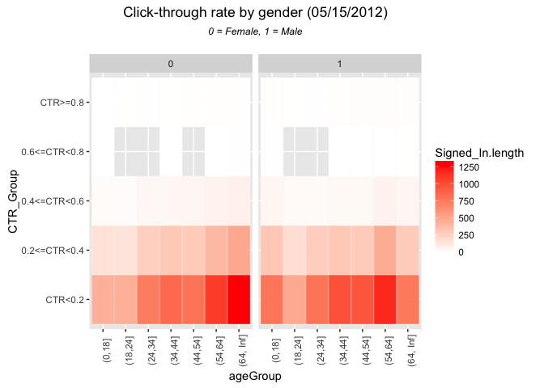

# nyt_EDA
Oscar Padilla  
July 7, 2016  


## DOWNLOAD THE DATA FOR DAY 15


```r
URL <- "http://stat.columbia.edu/~rachel/datasets/"
file_day <- "nyt15.csv"
download_file <- paste(URL, file_day, sep = "")
data_day <- read.csv(url(download_file))
```

## EXPLORE THE DATA


```r
str(data_day)
```

```
## 'data.frame':	437567 obs. of  5 variables:
##  $ Age        : int  0 49 0 86 56 57 0 0 0 77 ...
##  $ Gender     : int  0 0 0 0 1 0 0 0 0 0 ...
##  $ Impressions: int  6 3 8 4 1 8 9 7 3 4 ...
##  $ Clicks     : int  0 0 0 0 0 0 1 0 0 0 ...
##  $ Signed_In  : int  0 1 0 1 1 1 0 0 0 1 ...
```

```r
head(data_day)
```

```
##   Age Gender Impressions Clicks Signed_In
## 1   0      0           6      0         0
## 2  49      0           3      0         1
## 3   0      0           8      0         0
## 4  86      0           4      0         1
## 5  56      1           1      0         1
## 6  57      0           8      0         1
```

```r
nrow(data_day[data_day$Impressions == 0, ])
```

```
## [1] 2850
```

```r
nrow(data_day[data_day$Signed_In == 0, ])
```

```
## [1] 196781
```

ALMOST 200K USERS DIDN'T SIGN FOR WHOM NEITHER AGE NOR GENDER IS AVAILABLE

## DATA CLEANSING


```r
ImpSub <- data_day[data_day$Signed_In == 1 & data_day$Impressions > 0, ]
ImpSub$ageGroup <- cut(ImpSub$Age, c(-Inf, 0, 18, 24, 34, 44, 54, 64, Inf))
str(ImpSub)
```

```
## 'data.frame':	239239 obs. of  6 variables:
##  $ Age        : int  49 86 56 57 77 52 58 33 23 35 ...
##  $ Gender     : int  0 0 1 0 0 0 0 0 1 1 ...
##  $ Impressions: int  3 4 1 8 4 5 1 4 2 5 ...
##  $ Clicks     : int  0 0 0 0 0 0 0 0 0 0 ...
##  $ Signed_In  : int  1 1 1 1 1 1 1 1 1 1 ...
##  $ ageGroup   : Factor w/ 8 levels "(-Inf,0]","(0,18]",..: 6 8 7 7 8 6 7 4 3 5 ...
```

```r
summary(ImpSub)
```

```
##       Age             Gender        Impressions        Clicks       
##  Min.   :  7.00   Min.   :0.0000   Min.   : 1.00   Min.   :0.00000  
##  1st Qu.: 29.00   1st Qu.:0.0000   1st Qu.: 3.00   1st Qu.:0.00000  
##  Median : 41.00   Median :1.0000   Median : 5.00   Median :0.00000  
##  Mean   : 42.13   Mean   :0.5193   Mean   : 5.04   Mean   :0.07122  
##  3rd Qu.: 53.00   3rd Qu.:1.0000   3rd Qu.: 6.00   3rd Qu.:0.00000  
##  Max.   :103.00   Max.   :1.0000   Max.   :19.00   Max.   :4.00000  
##                                                                     
##    Signed_In      ageGroup    
##  Min.   :1   (34,44]  :52563  
##  1st Qu.:1   (44,54]  :47891  
##  Median :1   (24,34]  :43107  
##  Mean   :1   (54,64]  :33439  
##  3rd Qu.:1   (18,24]  :26286  
##  Max.   :1   (64, Inf]:21673  
##              (Other)  :14280
```

## CALCULATE THE CLICK-THROUGH-RATE


```r
ImpSub$CTR <- ImpSub$Clicks/ImpSub$Impressions
```

## PLOT DISTRIBUTION OF NUMBER OF IMPRESSIONS FOR AGE GROUPS


```r
ggplot(subset(ImpSub,), aes(x = Impressions, fill = ageGroup))+ geom_histogram(binwidth = 1)
```

<!-- -->

## PLOT DISTRIBUTION OF CLICK-THROUGH-RATE BY AGE GROUP


```r
ggplot(subset(ImpSub, CTR > 0), aes(x = CTR, fill = ageGroup)) + labs(title = "Click-through rate by age group (05/15/2012)")+ geom_histogram(binwidth = 0.1) + facet_wrap(~ageGroup)
```

<!-- -->

## DEFINE VARIABLE TO DEFINE USERS BASED ON CTR BEHAVIOR


```r
ImpSub$CTR_Group <- cut(ImpSub$CTR, c(-Inf, 0.2, 0.4, 0.6, 0.8, Inf))
levels(ImpSub$CTR_Group) <- c("CTR<0.2", "0.2<=CTR<0.4", "0.4<=CTR<0.6", "0.6<=CTR<0.8", "CTR>=0.8")
summary(ImpSub)
```

```
##       Age             Gender        Impressions        Clicks       
##  Min.   :  7.00   Min.   :0.0000   Min.   : 1.00   Min.   :0.00000  
##  1st Qu.: 29.00   1st Qu.:0.0000   1st Qu.: 3.00   1st Qu.:0.00000  
##  Median : 41.00   Median :1.0000   Median : 5.00   Median :0.00000  
##  Mean   : 42.13   Mean   :0.5193   Mean   : 5.04   Mean   :0.07122  
##  3rd Qu.: 53.00   3rd Qu.:1.0000   3rd Qu.: 6.00   3rd Qu.:0.00000  
##  Max.   :103.00   Max.   :1.0000   Max.   :19.00   Max.   :4.00000  
##                                                                     
##    Signed_In      ageGroup          CTR                 CTR_Group     
##  Min.   :1   (34,44]  :52563   Min.   :0.00000   CTR<0.2     :234354  
##  1st Qu.:1   (44,54]  :47891   1st Qu.:0.00000   0.2<=CTR<0.4:  4141  
##  Median :1   (24,34]  :43107   Median :0.00000   0.4<=CTR<0.6:   622  
##  Mean   :1   (54,64]  :33439   Mean   :0.01406   0.6<=CTR<0.8:    20  
##  3rd Qu.:1   (18,24]  :26286   3rd Qu.:0.00000   CTR>=0.8    :   102  
##  Max.   :1   (64, Inf]:21673   Max.   :1.00000                        
##              (Other)  :14280
```

## TOTAL NUMBER OF MALE IMPRESSIONS, CLICKS AND SIGNED_IN


```r
library(doBy)
summaryBy(Impressions + Signed_In + Clicks ~ CTR_Group, data = subset(ImpSub, Gender = 1), FUN = sum, na.rm = TRUE)
```

```
##      CTR_Group Impressions.sum Signed_In.sum Clicks.sum
## 1      CTR<0.2         1187539        234354      11521
## 2 0.2<=CTR<0.4           16616          4141       4652
## 3 0.4<=CTR<0.6            1439           622        718
## 4 0.6<=CTR<0.8              60            20         40
## 5     CTR>=0.8             108           102        108
```

## MEAN OF AGE, IMPRESSIONS, CLICKS, CTR AND PERCENTAGE OF MALES AND SIGNED_IN


```r
summaryBy(Impressions + Clicks + CTR + CTR_Group + Signed_In ~ Gender, data = subset(ImpSub, Impressions >0), FUN = c(mean))
```

```
##   Gender Impressions.mean Clicks.mean   CTR.mean CTR_Group.mean
## 1      0         5.038937  0.07258752 0.01434703       1.024964
## 2      1         5.040963  0.06995726 0.01379835       1.024003
##   Signed_In.mean
## 1              1
## 2              1
```

```r
# The number of males and females signed in are as follows (0 = Female; 1 = Male)
ImpSubSummary <- data.matrix(summaryBy(Signed_In ~ Gender, data = ImpSub, FUN = c(length)))
ImpSubSummary
```

```
##   Gender Signed_In.length
## 1      0           115006
## 2      1           124233
```

```r
# The proportion of males (and females) signed in are as follows (0 = Female; 1 = Male)
prop.table(ImpSubSummary, 2)
```

```
##   Gender Signed_In.length
## 1      0        0.4807159
## 2      1        0.5192841
```

## MEAN OF IMPRESSIONS, CLICKS, CTR AND PERCENTAGE OF MALES AND SIGNED_IN BY AGEGROUP


```r
summaryBy(Impressions + Clicks + CTR + CTR_Group + Signed_In ~ ageGroup, data = subset(ImpSub, Impressions >0), FUN = c(mean))
```

```
##    ageGroup Impressions.mean Clicks.mean    CTR.mean CTR_Group.mean
## 1    (0,18]         5.060644  0.13193277 0.026150689       1.047969
## 2   (18,24]         5.045538  0.05143422 0.010118931       1.017081
## 3   (24,34]         5.036119  0.05038625 0.009972842       1.016749
## 4   (34,44]         5.030287  0.04857029 0.009477533       1.015372
## 5   (44,54]         5.036270  0.05147105 0.010246735       1.017289
## 6   (54,64]         5.038249  0.10155806 0.020206971       1.036365
## 7 (64, Inf]         5.061782  0.14843353 0.029081921       1.052831
##   Signed_In.mean
## 1              1
## 2              1
## 3              1
## 4              1
## 5              1
## 6              1
## 7              1
```

```r
# The number of males and females signed in are as follows (0 = Female; 1 = Male)
ImpSubSum_ageGroup <- summaryBy(Signed_In ~ Gender + ageGroup, data = ImpSub, FUN = c(length))
# The proportion of males (and females) signed in are as follows (0 = Female; 1 = Male)
ImpSubSum_ageGroup$MaleProp <- prop.table(ImpSubSum_ageGroup[, 3])
ImpSubSum_ageGroup[ImpSubSum_ageGroup$Gender == 1, ]
```

```
##    Gender  ageGroup Signed_In.length   MaleProp
## 8       1    (0,18]             9114 0.03809580
## 9       1   (18,24]            13807 0.05771216
## 10      1   (24,34]            22608 0.09449964
## 11      1   (34,44]            27874 0.11651110
## 12      1   (44,54]            25303 0.10576453
## 13      1   (54,64]            17686 0.07392607
## 14      1 (64, Inf]             7841 0.03277476
```

## ADDITIONAL GRAPH: Analysis of Clicks > 0


```r
ImpSubSum_plot <- summaryBy(Signed_In ~ Gender + ageGroup + CTR_Group, data = subset(ImpSub, Clicks > 0), FUN = c(length))
ImpSubSum_plot
```

```
##    Gender  ageGroup    CTR_Group Signed_In.length
## 1       0    (0,18]      CTR<0.2              437
## 2       0    (0,18] 0.2<=CTR<0.4              158
## 3       0    (0,18] 0.4<=CTR<0.6               23
## 4       0    (0,18] 0.6<=CTR<0.8                1
## 5       0    (0,18]     CTR>=0.8                2
## 6       0   (18,24]      CTR<0.2              443
## 7       0   (18,24] 0.2<=CTR<0.4              149
## 8       0   (18,24] 0.4<=CTR<0.6               21
## 9       0   (18,24]     CTR>=0.8                3
## 10      0   (24,34]      CTR<0.2              731
## 11      0   (24,34] 0.2<=CTR<0.4              264
## 12      0   (24,34] 0.4<=CTR<0.6               40
## 13      0   (24,34]     CTR>=0.8                5
## 14      0   (34,44]      CTR<0.2              835
## 15      0   (34,44] 0.2<=CTR<0.4              297
## 16      0   (34,44] 0.4<=CTR<0.6               44
## 17      0   (34,44] 0.6<=CTR<0.8                1
## 18      0   (34,44]     CTR>=0.8                3
## 19      0   (44,54]      CTR<0.2              774
## 20      0   (44,54] 0.2<=CTR<0.4              290
## 21      0   (44,54] 0.4<=CTR<0.6               49
## 22      0   (44,54]     CTR>=0.8                8
## 23      0   (54,64]      CTR<0.2             1071
## 24      0   (54,64] 0.2<=CTR<0.4              395
## 25      0   (54,64] 0.4<=CTR<0.6               66
## 26      0   (54,64] 0.6<=CTR<0.8                1
## 27      0   (54,64]     CTR>=0.8                8
## 28      0 (64, Inf]      CTR<0.2             1299
## 29      0 (64, Inf] 0.2<=CTR<0.4              485
## 30      0 (64, Inf] 0.4<=CTR<0.6               82
## 31      0 (64, Inf] 0.6<=CTR<0.8                6
## 32      0 (64, Inf]     CTR>=0.8               10
## 33      1    (0,18]      CTR<0.2              769
## 34      1    (0,18] 0.2<=CTR<0.4              308
## 35      1    (0,18] 0.4<=CTR<0.6               55
## 36      1    (0,18] 0.6<=CTR<0.8                4
## 37      1    (0,18]     CTR>=0.8               10
## 38      1   (18,24]      CTR<0.2              482
## 39      1   (18,24] 0.2<=CTR<0.4              178
## 40      1   (18,24] 0.4<=CTR<0.6               28
## 41      1   (18,24]     CTR>=0.8                3
## 42      1   (24,34]      CTR<0.2              776
## 43      1   (24,34] 0.2<=CTR<0.4              274
## 44      1   (24,34] 0.4<=CTR<0.6               30
## 45      1   (24,34]     CTR>=0.8                6
## 46      1   (34,44]      CTR<0.2              968
## 47      1   (34,44] 0.2<=CTR<0.4              301
## 48      1   (34,44] 0.4<=CTR<0.6               34
## 49      1   (34,44] 0.6<=CTR<0.8                1
## 50      1   (34,44]     CTR>=0.8                9
## 51      1   (44,54]      CTR<0.2              944
## 52      1   (44,54] 0.2<=CTR<0.4              287
## 53      1   (44,54] 0.4<=CTR<0.6               37
## 54      1   (44,54] 0.6<=CTR<0.8                1
## 55      1   (44,54]     CTR>=0.8               11
## 56      1   (54,64]      CTR<0.2             1158
## 57      1   (54,64] 0.2<=CTR<0.4              460
## 58      1   (54,64] 0.4<=CTR<0.6               68
## 59      1   (54,64] 0.6<=CTR<0.8                2
## 60      1   (54,64]     CTR>=0.8               13
## 61      1 (64, Inf]      CTR<0.2              752
## 62      1 (64, Inf] 0.2<=CTR<0.4              295
## 63      1 (64, Inf] 0.4<=CTR<0.6               45
## 64      1 (64, Inf] 0.6<=CTR<0.8                3
## 65      1 (64, Inf]     CTR>=0.8               11
```

```r
ggplot(ImpSubSum_plot, aes(x = ageGroup, y = CTR_Group)) + geom_tile(aes(fill = Signed_In.length), color = "white") + scale_fill_gradient2(low = "white", high = "red", limit = c(0, 1300)) + facet_wrap(~Gender) + theme(axis.text.x = element_text(angle = 90)) + ggtitle(expression(atop("Click-through rate by gender (05/15/2012)", atop(italic("0 = Female, 1 = Male"), ""))))
```

<!-- -->
